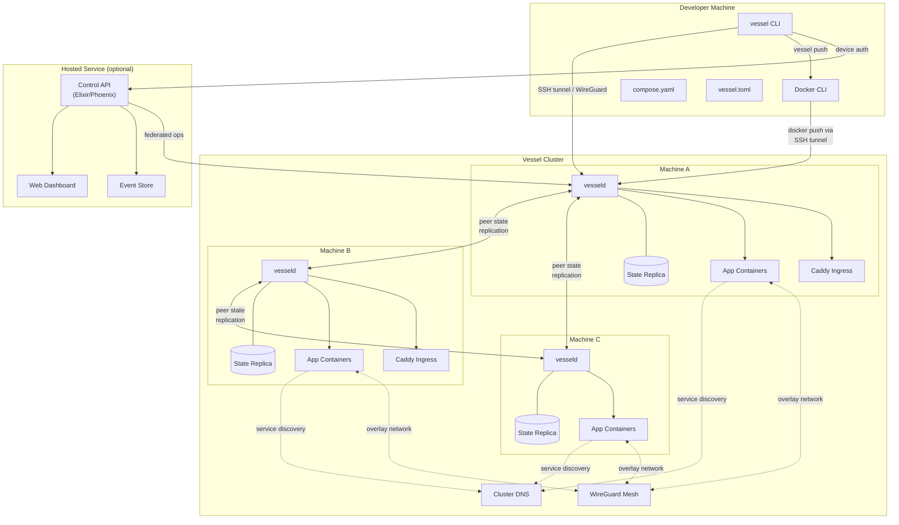
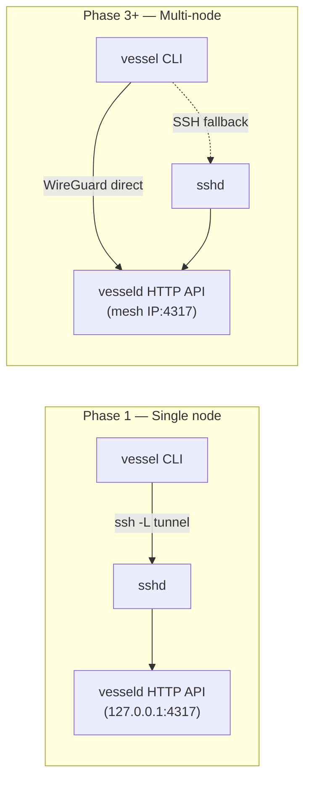
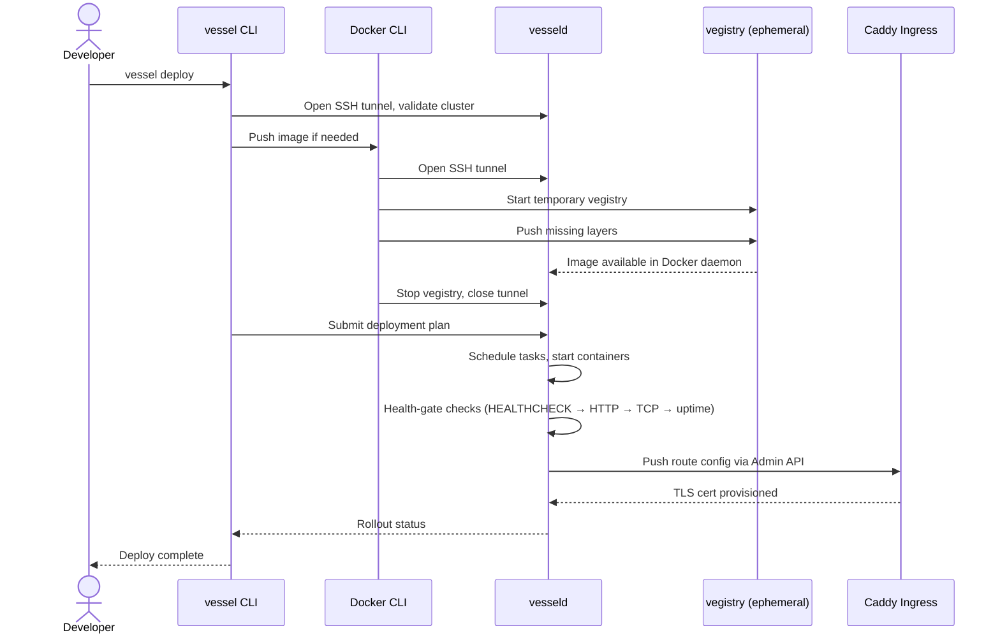
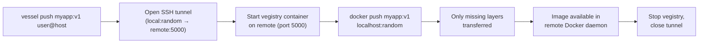
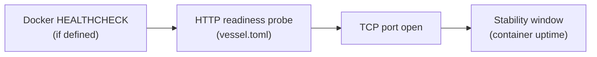
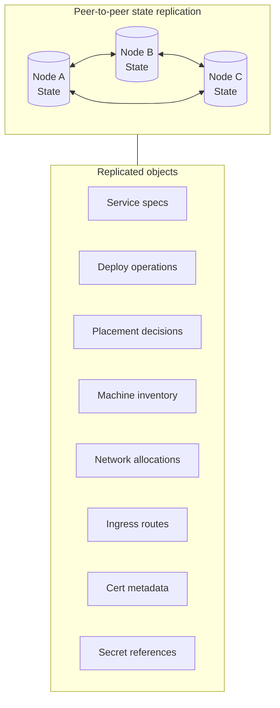
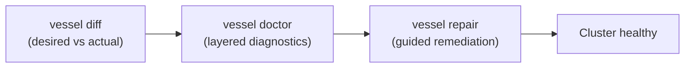

# System Overview

Vessel is a CLI-first, decentralised orchestrator for Docker hosts. It ships
containerised apps to remote machines over SSH without requiring a central
control plane or Kubernetes.

## High-level architecture



## Components

- **`vessel`** — operator CLI
- **`vesseld`** — per-node daemon (API endpoint)
- **`vegistry`** — image transfer registry helper
- **Caddy** — ingress service (TLS + L7 routing)
- **Cluster DNS** — service name resolution across nodes
- **WireGuard Mesh** — encrypted container-to-container overlay network
- **Hosted control service** — optional Elixir/Phoenix dashboard and event store

## Component overview

| Component | Binary | Role |
|-----------|--------|------|
| Vessel CLI | `vessel` | Operator interface. Parses compose/config, issues commands over SSH tunnel. |
| Machine Agent | `vesseld` | Per-node daemon. Exposes versioned HTTP+JSON API, manages containers via Docker Engine API. |
| Vegistry | `vegistry` | Ephemeral registry started on-demand during `vessel push` to receive image layers over an SSH tunnel. |
| Caddy Ingress | (Docker service) | L7 reverse proxy managed by `vesseld`. Handles TLS provisioning via Let's Encrypt. |
| Cluster DNS | (embedded in `vesseld`) | Resolves service names to container IPs for cross-machine communication. |
| WireGuard Mesh | (kernel + userland) | Encrypted overlay giving every container a unique routable IP across nodes. |
| Hosted Service | Elixir app | Optional dashboard, event store, and remote operations gateway. |

## Transport model



- **Phase 1**: CLI opens an SSH local-port-forward to `vesseld`'s localhost
  listener, then issues HTTP+JSON API calls through the tunnel.
- **Phase 3+**: CLI connects directly over the WireGuard mesh. SSH tunnel
  remains as a fallback when the mesh is unreachable.

## Deploy flow



## Image transfer (vegistry)



Vegistry implements a minimal Docker Registry V2 subset. It reads and writes
directly to the remote Docker daemon's image store, avoiding any intermediate
blob storage. Fallback: `docker save | ssh | docker load` when the registry
path fails.

## Health gate precedence

During rolling deploys and rollbacks, Vessel checks container health using the
first available signal in this order:



On repeated failures, the deploy engine retries up to a bounded limit, then
triggers automatic rollback to the previous revision.

## State replication (Phase 4+)



Each node holds a full copy of the cluster state. Mutations use an
operation-log with deterministic conflict resolution (operation IDs, monotonic
timestamps, actor IDs). Secret *values* are never stored in plaintext in the
replicated state — only references.

## Drift management



Reconciliation is explicit and operator-invoked. Vessel does not auto-reconcile
in the background. The drift tooling (`diff`, `doctor`, `repair`) gives
operators full visibility and control over corrections.

## Project config model

```
my-app/
├── compose.yaml      # Service definitions (image, ports, volumes, env)
├── vessel.toml       # Deploy targets, domains, env profiles, policy flags
└── ...
```

- **`compose.yaml`**: application and service source of truth.
- **`vessel.toml`**: Vessel-specific deployment metadata — target hosts,
  domains, environment profiles, deploy policy toggles.
- Default project name derives from directory name, overrideable in
  `vessel.toml`. Deployment identity is cluster-scoped: `<project>/<environment>`.

